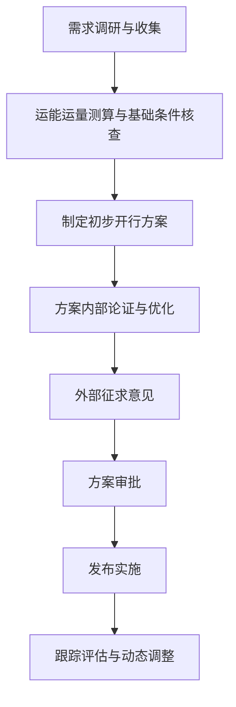
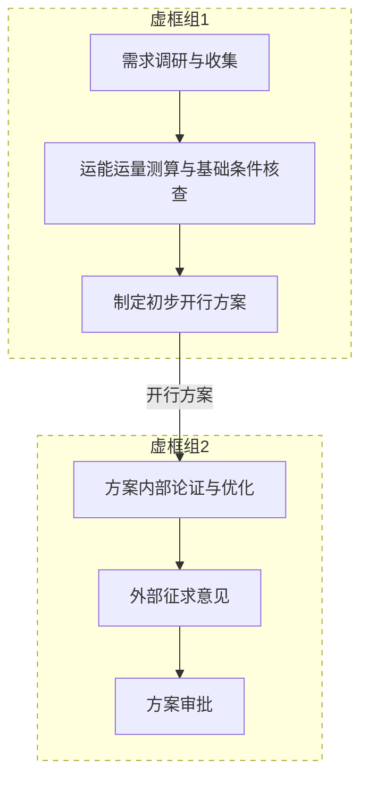

This is a test repsitory for learning and practice on how to use github

```mermaid
flowchart TD
    A[需求调研与收集] --> B[运能运量测算与基础条件核查]
    B --> C[制定初步开行方案]
    C --> D[方案内部论证与优化]
    D --> E[外部征求意见]
    E --> F[方案审批]
    F --> G[发布实施]
    G --> H[跟踪评估与动态调整]
```
## 更复杂的流程图

```mermaid
flowchart TD
    subgraph 虚框组1
        direction TB
        A[需求调研与收集]
        B[运能运量测算与基础条件核查]
        C[制定初步开行方案]
    end
    style 虚框组1 stroke-dasharray: 5 5

    subgraph 虚框组2
        direction TB
        D[方案内部论证与优化]
        E[外部征求意见]
        F[方案审批]
    end
    style 虚框组2 stroke-dasharray: 5 5

    A --> B
    B --> C
    C -- 开行方案 --> D
    D --> E
    E --> F
```
